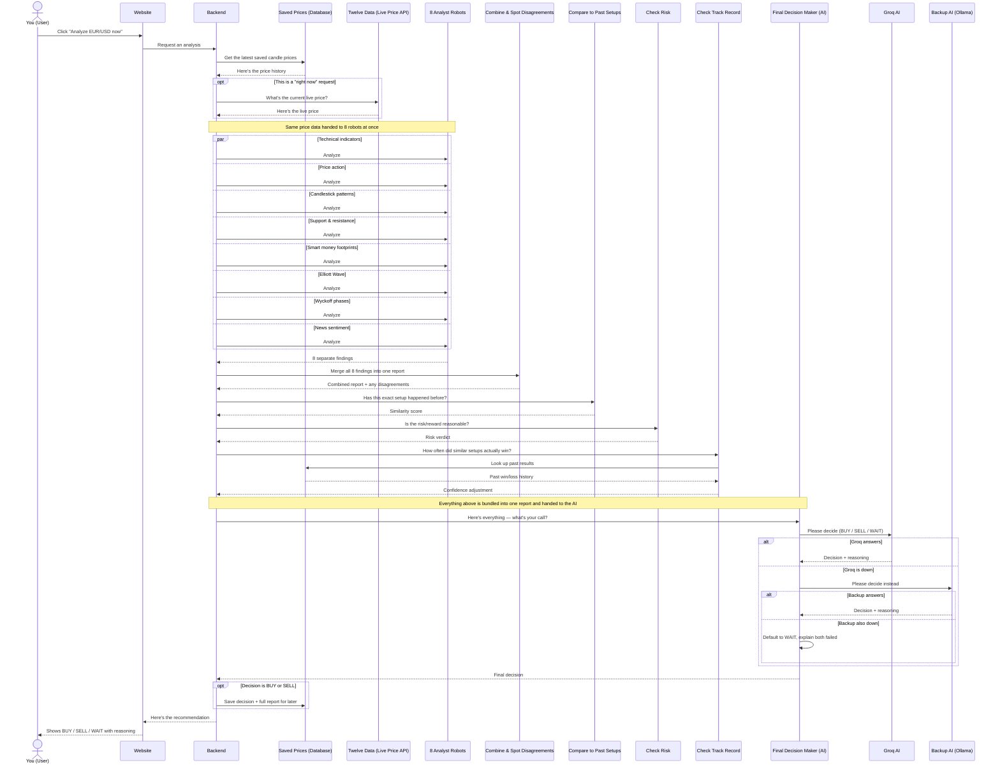
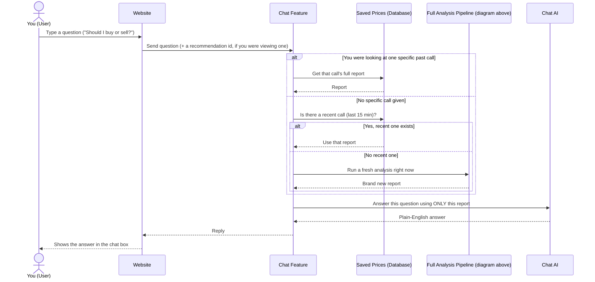

# ForexMind AI — Pipeline Sequence Diagrams

## 1. Main pipeline — "Analyze EUR/USD now"

## 2. Chat feature — reuses the pipeline above when needed

One thing not shown in either diagram: the **live chart** doesn't go through this pipeline at all — it just re-reads the database on a timer, and nothing currently refreshes that database automatically. It's a separate, much simpler read-only flow, not part of "the pipeline."
